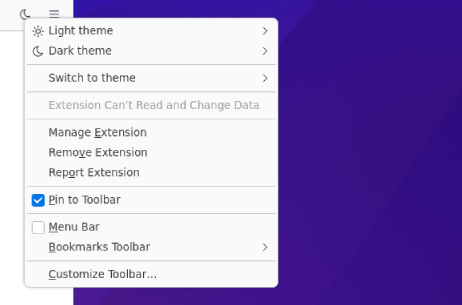

# Oneclick theme switcher

A firefox extension that switches between dark and light theme with a single click

[Firefox Add-Ons - Onclick Theme Switcher](https://addons.mozilla.org/de/firefox/addon/oneclick-theme-switcher/)

<picture>
  <source media="(prefers-color-scheme: dark)" srcset="./docs/screen-dark-1.png">
  
</picture>

## Development

```sh
npm i

npm start
npm test

# build zip
npm run build
```

## Credits

* Icons from [tabler/tabler-icons](https://github.com/tabler/tabler-icons)

## License

MIT
